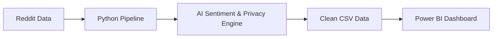

# Methodology: How "Why They Leave" Works

This document explains how the Rural Residency Sentiment Analyzer turns messy internet comments into actionable workforce data.

## 1. The Data
**Where it comes from**: We collect public discussions from Reddit, specifically looking at communities where medical professionals gather: r/Residency, r/medicalschool, and r/medicine.

**Why Reddit?**: Traditional exit interviews are formal and often guarded. Reddit provides a platform for anonymous, unfiltered, "peer-to-peer" honest discussions. This captures the *real* reasons for physician attrition that often don't make it onto official survey forms.

**What we search for**: The system listens for 6 specific conversation categories:
1.  **Recruitment**: Choosing programs, matching, ranking rural tracks.
2.  **Retention**: Burnout, leaving practice, quitting.
3.  **Partner/Family**: Spouse employment, schools, "two-body problem".
4.  **Oregon/OHSU**: Specific mentions of our region.
5.  **Compensation**: Salary, loans, cost of living.
6.  **Career**: Scope of practice, mentorship, autonomy.

**Volume**: We track the last 24 months of history and update 4 times daily to catch new trends as they emerge.

## 2. How We Measure Sentiment
We use a "Sentiment Analysis" model to grade every post.
- **Tools**: We use **RoBERTa**, an AI model from Hugging Face (specifically `cardiffnlp/twitter-roberta-base-sentiment-latest`). This model was trained on millions of social media posts, making it very good at understanding informal internet slang, sarcasm, and emojis—unlike older business tools.
- **The Score**: Every post gets a score from **-1.0 (Very Negative)** to **+1.0 (Very Positive)**.
    - *Example*: "I love the autonomy of rural practice!" → **+0.9** (Positive)
    - *Example*: "The call schedule is brutal and I miss the city." → **-0.8** (Negative)
    - *Example*: "Rural residency is 3 years long." → **0.1** (Neutral/Factual)

## 3. How We Find Topics (v2 Feature)
Imagine dumping 5,000 letters onto a table. "Topic Modeling" is like having a robot automatically sort them into piles based on what they are about, without being told the categories beforehand.
- It finds hidden themes we didn't know to look for.
- *Example*: It might create a pile for "Housing Shortages" even if we never programmed it to search for "housing".

## 4. How We Protect Privacy
Even though Reddit is public, we treat all data with HIPAA-aware standards.
- **PII Detection**: We use Microsoft Presidio to scan every post for:
    - Names (e.g., "Dr. Smith")
    - Locations (e.g., "Main Street Clinic")
    - Emails & Phone Numbers
- **Redaction**: These are automatically replaced with `[REDACTED]`.
- **Audit**: We keep a secure log of *where* redactions happened, but we do not store the original sensitive data in our analytics outputs.

## 5. What This Data CAN Tell You
- **Trends**: "Are complaints about rural partner employment increasing this year compared to last?"
- **Relative Pain Points**: "Do residents complain more about *salary* or *isolation*?"
- **Regional Sentiment**: "Is sentiment about Oregon residencies better or worse than the national average?"

## 6. What This Data CANNOT Tell You
- **NOT Representative**: This is only the opinion of people who post on Reddit (typically younger, tech-savvy). It is not a random sample of all physicians.
- **NOT Verification**: We cannot verify if a poster is actually a doctor.
- **Correlation ≠ Causation**: Just because attrition mentions go up, it doesn't prove *why* without further investigation.

## 7. How To Use This Dashboard
Use the Power BI dashboard to **generate hypotheses**, not to make final decisions.
- *Wrong way*: "Reddit says retention is bad, so we must raise salaries."
- *Right way*: "Reddit signals that partner employment is a rising concern. Let's add specific questions about spousal support to our next official survey to validate this."

## 8. Technical Architecture

