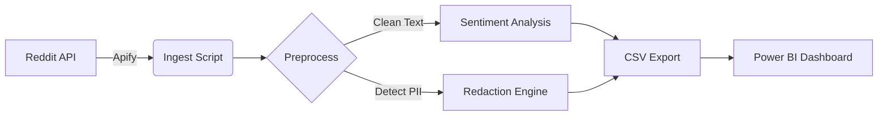

# 🏥 Why They Leave – Rural Residency Sentiment Analyzer


## Executive Summary
Rural residency programs face a recruitment and retention crisis, yet traditional surveys fail to capture the raw, unfiltered reasons why physicians leave. "Why They Leave" analyzes 24 months of Reddit discussions to identify the root causes of attrition using natural language processing and sentiment analysis. This tool provides distinct signals on recruitment, retention, and alumni career paths for OHSU Graduate Medical Education stakeholders.

## Live Dashboard
*Power BI dashboard available upon request — contains sensitive workforce data.*

## The Problem
Recruiting physicians to rural areas is critical for healthcare equity, but attrition rates remain high. Exit interviews are often polite and non-specific. To solve this, we need to hear what residents say to each other when they think no administrators are listening.

## The Solution
- **Scrapes** Reddit (r/Residency, r/medicalschool) for 24 months of historical data
- **Filters** for medical context and rural-specific keywords
- **Analyzes** sentiment using a transformer model trained on social media (RoBERTa)
- **Protects** privacy by automatically redacting names, locations, and dates (HIPAA-aligned)
- **Visualizes** trends in recruitment, partner employment, and compensation concerns

## Tech Stack

| Component | Technology | Description |
|-----------|------------|-------------|
| **Language** |  | Python 3.11+ |
| **Data Collection** |  | Apify Reddit Scraper |
| **NLP Model** |  | cardiffnlp/twitter-roberta-base-sentiment-latest |
| **PII Detection** |  | Microsoft Presidio |
| **Visualization** |  | Power BI Service |
| **Hardware** |  | M1 Optimized (MPS acceleration) |

## Architecture Diagram



## Project Structure

```text
rural_analyzer/
├── config.py                 # Central configuration
├── main.py                   # Orchestration script
├── ingest.py                 # Data fetching
├── preprocess.py             # Cleaning & relevance
├── sentiment.py              # RoBERTa model inference
├── pii.py                    # Privacy protection
├── keywords.py               # Theme detection
├── topics.py                 # BERTopic modeling
├── export.py                 # CSV generation
├── utils.py                  # Helpers
├── output/                   # Generated CSVs
├── logs/                     # Execution logs
└── tests/                    # Unit tests
```

## Installation

### Prerequisites
- Python 3.11+
- macOS (Apple Silicon recommended for performance)

### Setup
1. **Clone the repository:**
   ```bash
   git clone https://github.com/Rafia-Research/rural-residency-sentiment-analyzer.git
   cd rural-residency-sentiment-analyzer
   ```

2. **Create a virtual environment:**
   ```bash
   python3 -m venv venv
   source venv/bin/activate
   ```

3. **Install dependencies:**
   ```bash
   pip install -r requirements.txt
   ```

4. **Download required models:**
   ```bash
   # Download spaCy English model for Presidio
   python -m spacy download en_core_web_sm

   # Download NLTK data (stopwords)
   python -c "import nltk; nltk.download('stopwords'); nltk.download('punkt')"
   ```

5. **Configure API Token:**
   Copy `.env.example` to `.env` and add your Apify token:
   ```bash
   cp .env.example .env
   # Edit .env with your token
   ```

## Usage

### First Run (Backfill)
Analyze the last 24 months of data:
```bash
python main.py --backfill-only
```

### Daily Updates
Run incremental update (fetches new posts since last run):
```bash
python main.py --incremental
```

### Dry Run
Validate configuration without processing data:
```bash
python main.py --dry-run
```

## Configuration
All settings are managed in `config.py`. Key feature flags:

- `ENABLE_BERTOPIC`: Enable/disable advanced topic modeling (v2 feature)
- `ENABLE_ROLLING_AVERAGES`: Calculate 3/6/12 month trends
- `PII_ACTION`: "redact", "flag", or "none"

## Output Files

| File | Description |
|------|-------------|
| `reddit_sentiment.csv` | Main dataset with sentiment scores and flags |
| `sentiment_by_month.csv` | Aggregated trends over time |
| `negative_keywords.csv` | Top terms appearing in negative posts |
| `pii_audit_log.csv` | Log of redacted entities (privacy audit trail) |
| `topic_summary.csv` | Summary of discovered themes (if enabled) |
| `run_metadata.json` | Execution statistics and version info |

## Methodology
For a plain-English explanation of how this tool works, see [METHODOLOGY.md](METHODOLOGY.md).

## Limitations
- **Reddit Bias**: Users skew younger and are self-selecting.
- **Sarcasm**: While RoBERTa is state-of-the-art, distinct sarcasm without tone indicators can be misidentified.
- **False Positives**: PII detection favors caution; some generic terms might be redacted.

## Future Enhancements
- [ ] v2: Interactive menu bar scheduler app
- [ ] v2: Google Drive auto-sync
- [ ] v2: Topic evolution tracking over time

## Contributing
1. Fork the project
2. Create your feature branch (`git checkout -b feature/AmazingFeature`)
3. Commit your changes (`git commit -m 'Add some AmazingFeature'`)
4. Push to the branch (`git push origin feature/AmazingFeature`)
5. Open a Pull Request

## License
Distributed under the MIT License. See `LICENSE` for more information.

## Author
**Maximilien Rafia**
Business Data Analyst Candidate
OHSU Graduate Medical Education
