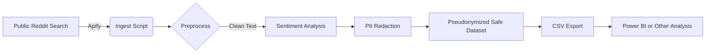

# 🏥 Why They Leave – Rural Residency Sentiment Analyzer


## Executive Summary
Rural residency programs face persistent recruitment and retention challenges. "Why They Leave" analyzes a configurable 24-month window of public Reddit discussions to surface exploratory themes associated with recruitment, retention, and career decisions. It is a hypothesis-generation tool, not a representative survey or causal study.

## The Problem
Recruiting physicians to rural areas is critical for healthcare equity, but attrition rates remain high. Exit interviews are often polite and non-specific. To solve this, we need to hear what residents say to each other when they think no administrators are listening.

## The Solution
- **Collects** public discussions from configured medical communities for a bounded 24-month window
- **Filters** for medical context and rural-specific keywords
- **Analyzes** sentiment using a transformer model trained on social media (RoBERTa)
- **Protects** privacy by redacting detected PII, pseudonymizing source IDs, and excluding usernames and source URLs from analytics outputs
- **Produces** Power BI-ready CSVs for exploring recruitment, partner employment, and compensation themes

## Tech Stack

| Component | Technology | Description |
|-----------|------------|-------------|
| **Language** |  | Python 3.11+ |
| **Data Collection** |  | Apify Reddit Scraper |
| **NLP Model** |  | cardiffnlp/twitter-roberta-base-sentiment-latest |
| **PII Detection** |  | Microsoft Presidio |
| **Visualization** |  | Power BI-ready CSV exports |
| **Hardware** |  | M1 Optimized (MPS acceleration) |

## Architecture Diagram


```mermaid
graph LR
    A[Public Reddit Search] -->|Apify| B(Ingest Script)
    B --> C{Preprocess}
    C -->|Clean Text| D[Sentiment Analysis]
    D --> E[PII Redaction]
    E --> F[Pseudonymized Safe Dataset]
    F --> G[CSV Export]
    G --> H[Power BI or Other Analysis]
```

## Project Structure

```text
rural_analyzer/
├── config.py                 # Central configuration
├── main.py                   # Orchestration script
├── ingest.py                 # Data fetching
├── preprocess.py             # Cleaning & relevance
├── sentiment.py              # RoBERTa model inference
├── pii.py                    # Privacy protection
├── keywords.py               # Theme detection
├── topics.py                 # BERTopic modeling
├── export.py                 # CSV generation
├── utils.py                  # Helpers
├── output/                   # Generated CSVs
├── logs/                     # Execution logs
└── tests/                    # Unit tests
```

## Installation

### Prerequisites
- Python 3.11+
- macOS (Apple Silicon recommended for performance)

### Setup
1. **Clone the repository:**
   ```bash
   git clone https://github.com/Rafia-Research/rural-residency-sentiment-analyzer.git
   cd rural-residency-sentiment-analyzer
   ```

2. **Create a virtual environment:**
   ```bash
   python3 -m venv venv
   source venv/bin/activate
   ```

3. **Install dependencies:**
   ```bash
   pip install -r requirements.txt
   ```

4. **Download required models:**
   ```bash
   # Download spaCy English model for Presidio
   python -m spacy download en_core_web_sm

   # Download NLTK data (stopwords)
   python -c "import nltk; nltk.download('stopwords'); nltk.download('punkt')"
   ```

5. **Configure API Token:**
   Copy `.env.example` to `.env` and add your Apify token:
   ```bash
   cp .env.example .env
   # Edit .env with your token
   ```

## Usage

### First Run (Backfill)
Analyze the last 24 months of data:
```bash
python main.py --backfill-only
```

### Incremental Updates
Fetch new records, merge them with the prior safe export, deduplicate by pseudonymous record ID, and recalculate trends:
```bash
python main.py --incremental
```

### Dry Run
Validate configuration without processing data:
```bash
python main.py --dry-run
```

## Configuration
All settings are managed in `config.py`. Key feature flags:

- `ENABLE_BERTOPIC`: Enable/disable advanced topic modeling (v2 feature)
- `ENABLE_ROLLING_AVERAGES`: Calculate 3/6/12 month trends
- `BACKFILL_MONTHS`: Historical collection window, also configurable through `.env`

## Output Files

| File | Description |
|------|-------------|
| `reddit_sentiment.csv` | Pseudonymized dataset containing redacted text, sentiment scores, and flags |
| `sentiment_by_month.csv` | Aggregated trends over time |
| `negative_keywords.csv` | Top terms appearing in negative posts |
| `pii_audit_log.csv` | Pseudonymized log of detected and redacted entities |
| `topic_summary.csv` | Summary of discovered themes (if enabled) |
| `run_metadata.json` | Execution statistics and version info |

For a portfolio-friendly preview of the safe output schema, see
[`examples/synthetic_reddit_sentiment.csv`](examples/synthetic_reddit_sentiment.csv).
The example is entirely synthetic and contains no collected Reddit content.

## Methodology
For a plain-English explanation of how this tool works, see [METHODOLOGY.md](METHODOLOGY.md).

## Limitations
- **Reddit Bias**: Users skew younger and are self-selecting.
- **Query Selection Bias**: Search terms intentionally target rural-workforce concerns, so sentiment percentages are not population prevalence estimates.
- **Clustered Discussions**: Posts and their comments are related observations and should not be interpreted as independent survey responses.
- **Sarcasm and Domain Fit**: A general social-media sentiment model can misread sarcasm, clinical language, and local context.
- **False Positives**: PII detection favors caution; some generic terms might be redacted.

## Future Enhancements
- [ ] v2: Interactive menu bar scheduler app
- [ ] v2: Google Drive auto-sync
- [ ] v2: Topic evolution tracking over time

## Contributing
1. Fork the project
2. Create your feature branch (`git checkout -b feature/AmazingFeature`)
3. Commit your changes (`git commit -m 'Add some AmazingFeature'`)
4. Push to the branch (`git push origin feature/AmazingFeature`)
5. Open a Pull Request

## License
Distributed under the MIT License. See `LICENSE` for more information.

## Author
**Maximilien Rafia**
